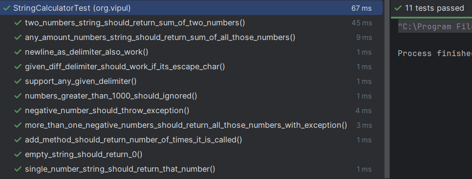

# String Calculator - TDD Kata (Java + JUnit)

This project is a Java implementation of the **String Calculator Kata** using **Test-Driven Development (TDD)** and **JUnit 5**. The objective is to incrementally build a string-based calculator by writing tests first and then implementing code to pass those tests.

---

## Features

The `StringCalculator` class provides an `add(String input)` method that returns the sum of numbers in a string, based on various delimiter rules and validation requirements.

Supported features include:

* Returns 0 for an empty string.
* Handles a single number string.
* Computes the sum of comma-separated or newline-separated numbers.
* Supports any amount of numbers.
* Accepts custom delimiters specified using `//[delimiter]\n`.
* Supports special characters (like `\t`, `\\`, etc.) as custom delimiters.
* Throws an exception for negative numbers.
* Lists all negative numbers in the exception message.
* Ignores numbers greater than 1000.
* Tracks the number of times the `add()` method is called.

---

## How to Run

### Prerequisites

* Java 8 or later
* JUnit 5
* Maven or IntelliJ IDEA

### Running Tests

You can run tests using:

#### Using Maven

```bash
mvn test
```

#### Using IntelliJ

* Right-click on `StringCalculatorTest.java` → Run All Tests

---

## Method Signature

```java
public int add(String input)
```

---

## Project Structure

```
src/
├── main/
│   └── java/
│       └── org.vipul/
│           └── StringCalculator.java
└── test/
    └── java/
        └── org.vipul/
            └── StringCalculatorTest.java
```

---

## Test Cases

The test class `StringCalculatorTest` contains the following test cases to verify the correctness of the `add` method.

### 1. Empty String Should Return 0

* **Test**: `empty_string_should_return_0`
* **Input**: `""`
* **Expected Output**: `0`

---

### 2. Single Number String Should Return That Number

* **Test**: `single_number_string_should_return_that_number`
* **Inputs**: `"11"`, `"50"`
* **Expected Outputs**: `11`, `50`

---

### 3. Two Numbers String Should Return Their Sum

* **Test**: `two_numbers_string_should_return_sum_of_two_numbers`
* **Inputs**: `"3,4"`, `"10,40"`
* **Expected Outputs**: `7`, `50`

---

### 4. Any Number of Inputs Should Return Total Sum

* **Test**: `any_amount_numbers_string_should_return_sum_of_all_those_numbers`
* **Inputs**:

    * `"2,4"` → `6`
    * `"2,4,6"` → `12`
    * `"1,2,3,4"` → `10`
    * `"1,2,3,4,5,6,7,8,9,10"` → `55`

---

### 5. Newline as Delimiter Should Also Work

* **Test**: `newline_as_delimiter_also_work`
* **Inputs**:

    * `"2\n3"` → `5`
    * `"2\n4\n6"` → `12`
    * `"10\n20,30"` → `60`

---

### 6. Custom Delimiter Should Work

* **Test**: `support_any_given_delimiter`
* **Inputs**:

    * `"//;\n1;2"` → `3`
    * `"//;\n1;2;3"` → `6`

---

### 7. Custom Delimiter as Escape Character Should Work

* **Test**: `given_diff_delimiter_should_work_if_its_escape_char`
* **Inputs**:

    * `"//\\\n1\\2"` → `3`
    * `"//\t\n1\t2\t3"` → `6`

---

### 8. Negative Numbers Should Throw Exception

* **Test**: `negative_number_should_throw_exception`
* **Inputs**:

    * `"3,4,-8"` → Exception with message: `"Negatives not allowed: -8"`
    * `"-8"` → Exception with message: `"Negatives not allowed: -8"`

---

### 9. Multiple Negative Numbers Should Be Reported in Exception

* **Test**: `more_than_one_negative_numbers_should_return_all_those_numbers_with_exception`
* **Inputs**:

    * `"-8,2,3,-1"` → Exception with message: `"Negatives not allowed: -8,-1"`
    * `"1,-2,3,-4,-5,-6,7,8,-9"` → Exception with message: `"Negatives not allowed: -2,-4,-5,-6,-9"`

---

### 10. Add Method Should Return Number of Times It Is Called

* **Test**: `add_method_should_return_number_of_times_it_is_called`
* **Input**: Call `add()` multiple times
* **Expected Output**: Call count should match the number of invocations

---

### 11. Numbers Greater Than 1000 Should Be Ignored

* **Test**: `numbers_greater_than_1000_should_ignored`
* **Inputs**:

    * `"1001,2"` → `2`
    * `"1001,1,2,3"` → `6`

---

## Screenshots

### TestCases 1-9



---

## Refactoring and Improvements

Each feature was implemented incrementally, and tests were written to ensure functionality. The final implementation supports various delimiters, handles new lines, and validates negative numbers, providing a robust and extensible solution. The implementation also tracks how many times the `add` method is called and ignores numbers greater than 1000.

---

## References

* [TDD Kata: String Calculator by Roy Osherove](http://osherove.com/tdd-kata-1)
* [Twilio Blog: Writing Effective Unit Tests in Java with JUnit](https://www.twilio.com/en-us/blog/developers/community/java-junit-effective-unit-tests)
* [freeCodeCamp: Introduction to Test-Driven Development](https://www.freecodecamp.org/news/an-introduction-to-test-driven-development-c4de6dce5c/)
* [JUnit 5 User Guide](https://junit.org/junit5/docs/current/user-guide/)

---

## Author

Vipul Lakum
Email: [lakumvipul6351@gmail.com](mailto:lakumvipul6351@gmail.com)
